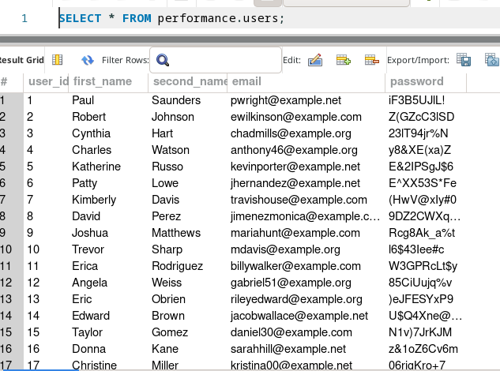

**Доповідь підготував**:  
студент 2-го курсу, групи ІМ-21 *Сірик Максим* [Email](mailto:erotourtes@gmail.com), [Telegram](https://t.me/mabooled)

**Керівник**  
доцент кафедри ОТ ФІОТ, к.т.н., доцент *Андрій БОЛДАК*  

[НТУУ "КИЇВСЬКИЙ ПОЛІТЕХНІЧНИЙ ІНСТИТУТ імені ІГОРЯ СІКОРСЬКОГО](https://kpi.ua/)  
[Факультет інформатики та обчислювальної техніки](https://fiot.kpi.ua/)  
[Кафедра обчислювальної техніки](https://comsys.kpi.ua/)  
Київ

## README Translation
[Українська](https://github.com/erotourtes/Database-Performance/blob/main/README.ua.md)

## Performance in SQL (MySQL)
First, we need to create a database and fill it with data. 
Follow these steps:
1. navigate to the `sql/schema.sql`
2. run the script in your database
3. navigate to the `src/`
4. add `.local.env` with the content of `.env` file
5. run `python main.py` to fill the database with random data (you can change the number of rows in the `main.py` file)
> install python dependencies `pip install -r requirements.txt`

The database is ready to use. Now you can run the queries.



## Indexes
Let's start with the definition.
An index is a data structure that improves the speed of data retrieval operations on a database table 
at the cost of additional writes and storage space to maintain the index data structure. 

Indexes are used to quickly locate data without having to search every row in a database table 
every time a database table is accessed. 
Indexes can be created using one or more columns of a database table, 
providing the basis for both rapid random lookups and efficient access to ordered records.

### Indexes in MySQL
MySQL has several index types:
- Based on the number of columns
  - Column Indexes
  - Composite Indexes
  - Full-text Indexes
- Based on purpose
  - Primary key index
  - Secondary index
  - Unique index (secondary index with unique values)
  - Spatial index (for geometry data types that are NOT NULL)
  - FULLTEXT index (full-text search)
  - Descending index (keys stored in descending order)

But how we can determine whether an index was used or not?
We can use `EXPLAIN` statement to get information about how MySQL executes a query.
> Note: The `DESCRIBE` and `EXPLAIN` statements are synonyms.

```sql
EXPLAIN SELECT * FROM `users` WHERE `user_id` = 1;
```

The result of the query above should be like this:
| id | select_type | table | partitions | type | possible_keys | key | key_len | ref | rows | filtered | Extra |
| --- | --- | --- | --- | --- | --- | --- | --- | --- | --- | --- | --- |
| 1 | SIMPLE | users | NULL | **const** | PRIMARY | PRIMARY | 4 | const | **1** | 100.00 | NULL |

The most important columns are `type` and `key`.
- `type` column shows how MySQL will execute the query.
- `key` column shows which index will be used. (in our case it is `PRIMARY`, because `PRIMARY KEY` is also an index!)
> Lesson: Always use `PRIMARY KEY` in your tables and keep it small.  
> [For more info](https://planetscale.com/blog/how-read-mysql-explains)

---

### Full Table Scan

Let's find out if we have `Jesus` in our database.
```sql
EXPLAIN SELECT * 
FROM `users` 
WHERE `first_name` = "Jesus";
```
| id | select_type | table | partitions | type | possible_keys | key | key_len | ref | rows | filtered | Extra |
| --- | --- | --- | --- | --- | --- | --- | --- | --- | --- | --- | --- |
| 1 | SIMPLE | users | NULL | <ins>ALL</ins> | NULL | NULL | NULL | NULL | <ins>9684</ins> | 10.00 | Using where |

Note that `type` is `ALL` and `key` is `NULL`. It means that MySQL will scan all rows in the table to find the matching rows. 

---

### Creating Indexes
Before creating indexes, we need to know what columns we will use in our queries.
Don't blindly create indexes on every column in your table.

Before creating an index, you need to consider the following:
- Indexes are stored in the memory. So, the more indexes you have, the more memory you need.
- Indexes are updated on every insert, update, and delete. So, the more indexes you have, the slower your queries will be.
- Indexes can be used only on the columns that are used in the query. So, if you have an index on the `name` column,
but you are searching by `email`, the index will not be used.
- Duplicated indexes

You can check existing indexes with:
```sql
SHOW INDEXES IN `users`;
```

---

### Column Indexes
#### Syntax
```sql
-- CREATE INDEX idx_name ON table (field)
CREATE INDEX idx_first_name ON `users` (`first_name`);
```

> We can use column index in `WHERE`, `ORDER BY`, and `GROUP BY` clauses; `MIN()` and `MAX()` functions.  
> [For more info](https://dev.mysql.com/doc/refman/8.0/en/mysql-indexes.html)

#### Example
Let's execute the query again (with the index from [syntax section](#syntax)):
```sql
EXPLAIN SELECT * 
FROM `users` 
WHERE `first_name` = "Jesus";
```
| id | select_type | table | partitions | type | possible_keys | key | key_len | ref | rows | filtered | Extra |
| --- | --- | --- | --- | --- | --- | --- | --- | --- | --- | --- | --- |
| 1 | SIMPLE | users | NULL | <ins>ref</ins> | idx_user_name | idx_name | 222 | const | <ins>7</ins> | 100.00 | NULL |

Take a look at the `type` and `key` columns.  

Also, the `EXPLAIN` shows us that row interaction came from 9684 to 7 (Because I have 7 Jesus in my database)!

---

### Composite Indexes
#### Syntax
```sql
-- CREATE INDEX idx_name ON table (field1, field2, ..., field16)
CREATE INDEX idx_first_name_second_name ON `users` (`first_name`, `second_name`);
```

#### Example
Let's consider this query (with the index from [syntax section](#syntax-1)):
```sql
SELECT * FROM `users` WHERE `first_name` = "Jesus" AND `second_name` = "Lowe"
```
| id | select_type | table | partitions | type | possible_keys | key | key_len | ref | rows | filtered | Extra |
| --- | --- | --- | --- | --- | --- | --- | --- | --- | --- | --- | --- |
| 1 | SIMPLE | users | NULL | **ref** | idx_first_name_second_name | idx_first_name_second_name | 444 | const,const | **1** | 100.00 | NULL |

However, if we try to use only `second_name` in our query, the index will not be used as it is not the leftmost column in our index.
This is because the index is built on the first column (`first_name`), therefore
order of columns in the index **DOES** matter. We can imagine it in form of a table

| Country | Person |
| --- | --- |
| Ukraine | John; Dan; Marc |
| USA | Kate, Castle, Brown, Obama |

| Person | Country |
| --- | --- |
| John | Ukraine |
| Dan | Ukraine |
| Marc | Ukraine |
| Kate | USA |
| Castle | USA |
| Brown | USA |
| Obama | USA |

As a rule of thumb, you should put the most selective column first (the column with the most unique values) 
so the first column in the index would discard the most number of rows. However, take your queries into account first.


> In my case my table has more unique `first_name` values than `second_name` values, so I put `first_name` first.  
```sql
SELECT  COUNT(DISTINCT first_name) FROM `users`;
SELECT  COUNT(DISTINCT second_name) FROM `users`;
```

---

### Full-text Indexes
#### Syntax
```sql
-- CREATE FULLTEXT INDEX idx_name ON table (field1, field2, ..., field16)
CREATE FULLTEXT INDEX idx_content ON `posts` (`content`);

-- MATCH(name, name1) AGAINST("some text -exclude +include 'exact phrase'" IN BOOLEAN MODE)
```
> Read more about [Boolean mode](https://dev.mysql.com/doc/refman/8.0/en/fulltext-boolean.html)

#### Example
Let's find the post which talks about 'business'.
```sql
EXPLAIN SELECT * FROM posts
WHERE content LIKE "%business%";
```

| id | select_type | table | partitions | type | possible_keys | key | key_len | ref | rows | filtered | Extra |
| --- | --- | --- | --- | --- | --- | --- | --- | --- | --- | --- | --- |
| 1 | SIMPLE | posts | NULL | **ALL** | NULL | NULL | NULL | NULL | **19705** | 11.11 | Using where |

Let's find out the cost of the query:
```sql
EXPLAIN ANALYZE SELECT * FROM posts
WHERE content LIKE "%business%";
```
> Note: `ANALYZE` is not a part of the `EXPLAIN` statement. It is a separate statement.

In my case `cost` is `2043`

Now let's create a [full-text index](#syntax-2) and check the cost again.
```sql
EXPLAIN ANALYZE SELECT * FROM posts
WHERE MATCH(content) AGAINST("business")
```
The cost dropped to `1`!

> Note: If we run `AGAINST ("business money")` it will find posts that contain either `business` or `money` or both.

---

## Conclusion
1. It is very important to use indexes with caution.
1. Covering indexes (which entirely cover a query) are better than multiple single-column indexes.

1. It is important to write queries that use indexes.
For example, if you have a query like this:
```sql
EXPLAIN SELECT * FROM `users`
WHERE `first_name` = "Jesus" OR `second_name` = "Lowe"
```
MySQL won't use any index, however
if we rewrite the query to this:
```sql
SELECT * FROM `users`
WHERE `first_name` = "Jesus"
UNION
SELECT * FROM `users`
WHERE `second_name` = "Lowe"
```
MySQL will use index.
